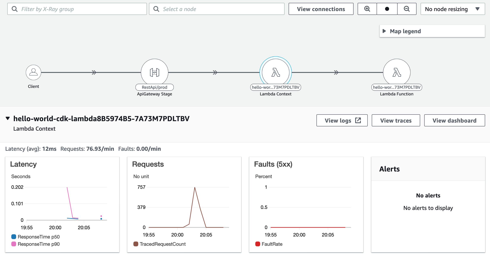

hello-world-cdk
===============

A simple demo application to deploy an API Gateway and a Python Lambda function using the AWS CDK. You can deploy the app by running 'cdk bootstrap' and 'cdk deploy' from the root of the repo folder.

Once the stack has been deployed and has been invoked through the API Gateway, you can view performance traces in the X-Ray or CloudWatch Service Lens console. 

Source code
-----------

You can edit the following files to modify the stack;

* hello_world_cdk/hello_world_stack.py

The CDK stack defining the AWS infrastructure

* lambda/lambda.py

The Python Lambda function which serves the API Gateway response
